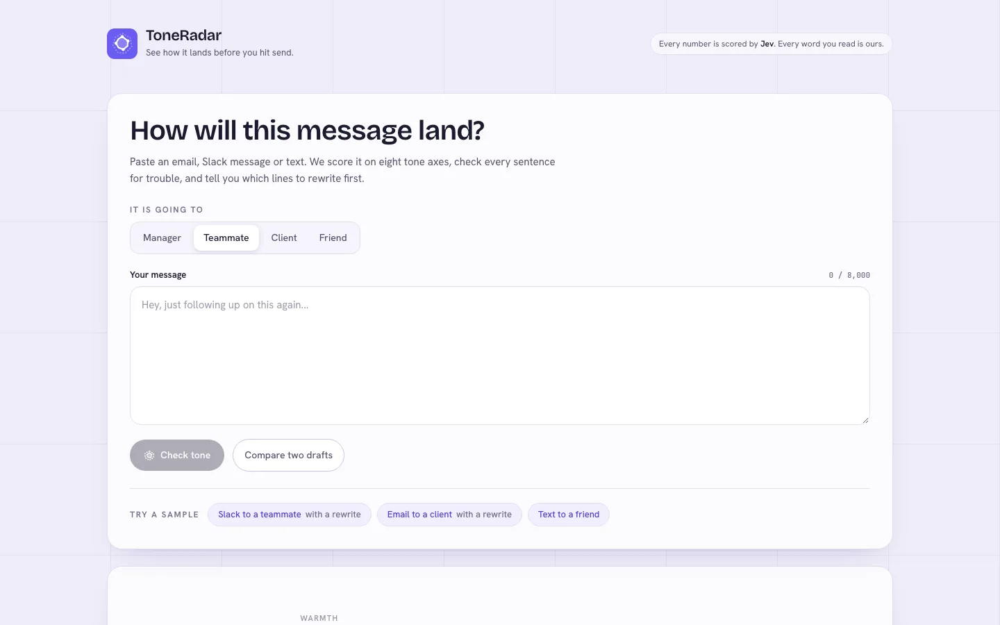
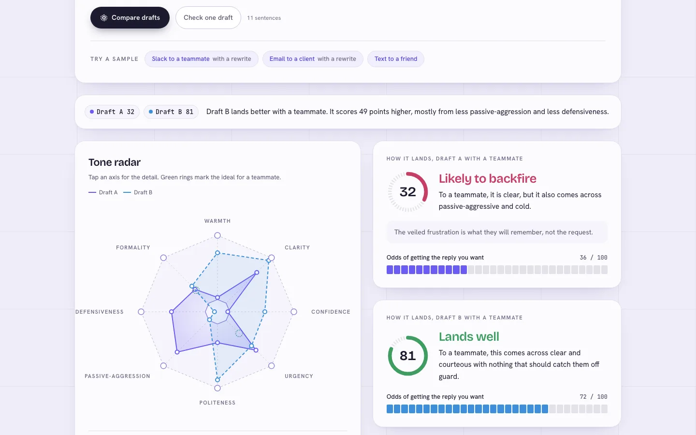
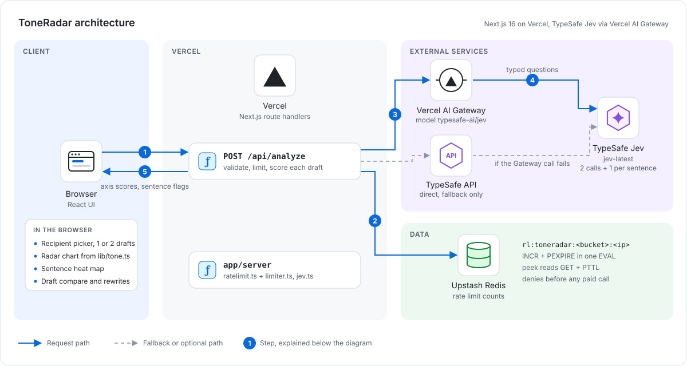

# ToneRadar

Check how a message will land before you send it.

**Live demo:** https://toneradar.vercel.app


## How it works

Paste a message you are about to send and see how it will land before you hit send. Pick who it is for (manager, teammate, client or friend) and ToneRadar sends the message and that context to TypeSafe's Jev as state. Jev answers eight score questions about the whole message (warmth, clarity, confidence, urgency, politeness, passive-aggression, defensiveness, formality, each with five ordered criteria), a boolean on whether you will get the reply you want, and eight booleans per sentence such as "reads as passive-aggressive", "could be misread as angry", "hedges unnecessarily" and "is a clear ask". Jev only returns numbers. The radar chart, the heat-marked message, the verdict, the rewrite list and every line of copy are computed in `lib/tone.ts` from those numbers. You can also compare two drafts on one radar.

## Screenshots





A longer recording is in [docs/demo.mp4](docs/demo.mp4).

## Architecture



1. The browser posts one or two drafts and the recipient to `POST /api/analyze`.
2. The route validates the input, then takes a rate limit slot in Upstash Redis and answers 429 when the window is used up.
3. It sends each draft and each sentence to Jev through Vercel AI Gateway (`typesafe-ai/jev`).
4. Jev answers typed score and yes/no questions. If the Gateway fails, the same questions go straight to the TypeSafe API (dashed path).
5. The route returns the numbers and the browser draws the radar, heat map and rewrite list from them in `lib/tone.ts`.

**Why it is built this way.** The TypeSafe and Gateway keys stay on the server. Jev only returns numbers, and every verdict and line of copy is computed in code from them. The limit is counted in Redis before any paid call, so it holds across Vercel instances.

## Stack

Next.js 16 (App Router), React 19, Tailwind CSS v4, TypeScript and the Vercel AI SDK, deployed on Vercel. Jev calls go through Vercel AI Gateway and fall back to the TypeSafe API. Unit tests use the Node test runner.

## Run it

```bash
npm install
cp .env.example .env.local   # then fill in a key
npm run dev                  # http://localhost:3000
npm test                     # unit tests for the scoring logic
npm run build && npx next start -p 3101
```

## Config

| Variable | Default | What it does |
| --- | --- | --- |
| `AI_GATEWAY_API_KEY` | none | Vercel AI Gateway key, tried first |
| `TYPESAFE_API_KEY` | none | Direct TypeSafe API key, used as fallback |
| `RATE_LIMIT_ANALYZE` | `5` | Checks allowed per IP per window |
| `RATE_LIMIT_WINDOW_MS` | `3600000` | Rate limit window in milliseconds |
| `KV_REST_API_URL`, `KV_REST_API_TOKEN` | none | Upstash Redis that holds the rate limit counts |

Limits per request are two drafts, 8,000 characters each, and the first 20 sentences of each draft get scored.

Rate limit counts are global across instances because they live in Upstash Redis, keyed per app and per IP, with IPv6 grouped by /64. The window starts at your first counted request. Without the Redis variables (local dev, tests) counts fall back to memory, and if Redis is set but unreachable the API answers 503 rather than letting requests through.

## Related

Built alongside [Headline Arena](https://headline-arena-gamma.vercel.app), [FinePrint](https://fineprint-beta.vercel.app), [fallacy finder](https://fallacy-finder-nine.vercel.app) and [PitchPanel](https://pitchpanel.vercel.app), all on TypeSafe Jev. The first one was [JobFit](https://github.com/Sahilll15/jobfit).
